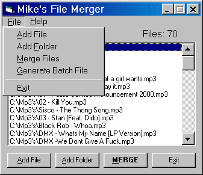



## Mike's File Merger \*Fixed\*

### Description

This will let you merge any type of file(s) into one big file. This will work with Almost all audio files (.mp3, .wav) and almost all Video files (.Avi, .Mpeg). Just think, merging all your favorite mp3s into one big file so you don't have to keep making playlists on your audio player and just think if you have a split up DiVX movie and want to put all of the parts together, this will do it. This will also merge .VOB files ripped from your DVD!   This program includes the following:  1.) Ability to merge a list of files top to bottom all together into one file.  2.)Lets you have the option of just generating a Batch file to merge your files. This way if you wanted to you could include the batch file with your split up files so a user can merge them together again.  3.) Option menu to manipulate the File Listbox  4.)Ability to add a file either by Drag and Droping a file(s) into the File Listbox or by pressing the Add File CommandButton or Menu.  5.) Ability to add all the files from a selected folder and/or it's sub-directory's files.  So check it out and please vote for my code.  -Mike Canejo
 
### More Info
 
Files

This merges files into one file.

Merged File

If its over 500 MB it will take about 25 minutes depending on your HD transfer speed.

             |
---                |---
**Submitted On**   |2000-06-25 10:18:34
**By**             |[Michael L\. Canejo](https://github.com/Planet-Source-Code/PSCIndex/blob/master/ByAuthor/michael-l-canejo.md)
**Level**          |Intermediate
**User Rating**    |4.7 (80 globes from 17 users)
**Compatibility**  |VB 4\.0 \(32\-bit\), VB 5\.0, VB 6\.0
**Category**       |[Complete Applications](https://github.com/Planet-Source-Code/PSCIndex/blob/master/ByCategory/complete-applications__1-27.md)
**World**          |[Visual Basic](https://github.com/Planet-Source-Code/PSCIndex/blob/master/ByWorld/visual-basic.md)
**Archive File**   |[CODE\_UPLOAD71356252000\.zip](https://github.com/Planet-Source-Code/michael-l-canejo-mike-s-file-merger-fixed__1-9138/archive/master.zip)

